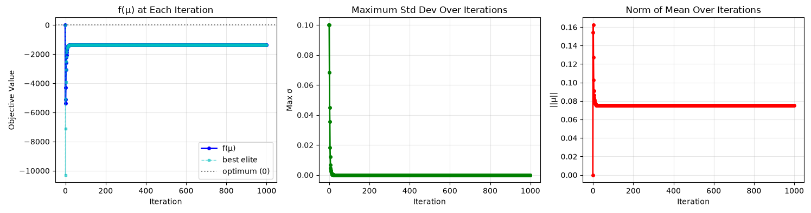
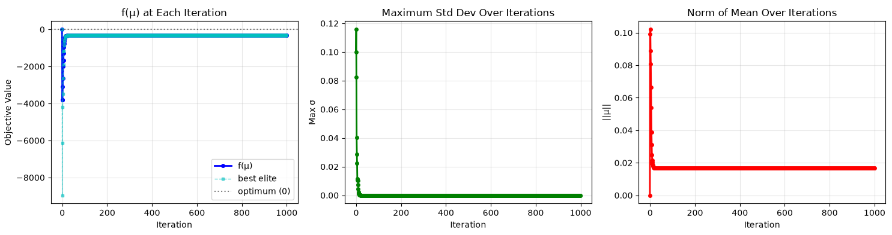

# 2026-07-04 發現日誌

昨天說到 $H$ 太大會破壞 policy prior, 這是因為初始 variance 設置太大, 再配合 number of samples 數量太少, 導致第一次更新跳到奇怪的地方後, 想要調整回來卻遇到 premature convergence 的問題卡住了。

證據如下:

## 實驗一、Pure CEM Solving a Static Objective Function

我們建立一個 20 維度的 objective function, 他的 global maximizer 在原點, 其餘皆以線性的方式下降。實作請見 `pureCEM.py`。

一開始, 我們直接把 $\mu$ initialize 在原點, 也就是 global optimal。然後, 我們的 sigma 給到 0.3, 但 number of samples 只有給 100。結果如下:

1.

2. 

這兩張圖是用不同 seed 跑相同的實驗, 可以看到 premature convergence 的函數值都不一樣, 證明是受第一次的更新影響的。

## 實驗二、Policy Prior CEM with Conservative Exploration

我們重新跑了昨天的 Policy Prior CEM 實驗，但是 <mark>最重要的差異是: 我們讓 distribution 的 std 與 $\frac{1}{H}$ 倍正相關</mark>。這讓 initial exploration 得以隨著搜尋空間越大而越小。實驗結果如下:

可以看到 cost 不會再超過 policy prior (SAC) 的 cost-to-go 了。

## Takeaway: 第一次的 CEM 更新非常重要。第一次 variance 相對於 number of samples 太大的話, 會導致 elite 區域跑到離 policy prior 太遠的地方, 這樣就白白浪費 policy prior 的好心了。

Next question: 那麼, 「維度」、「initial variance」、「number of samples」 究竟要維持什麼比例?