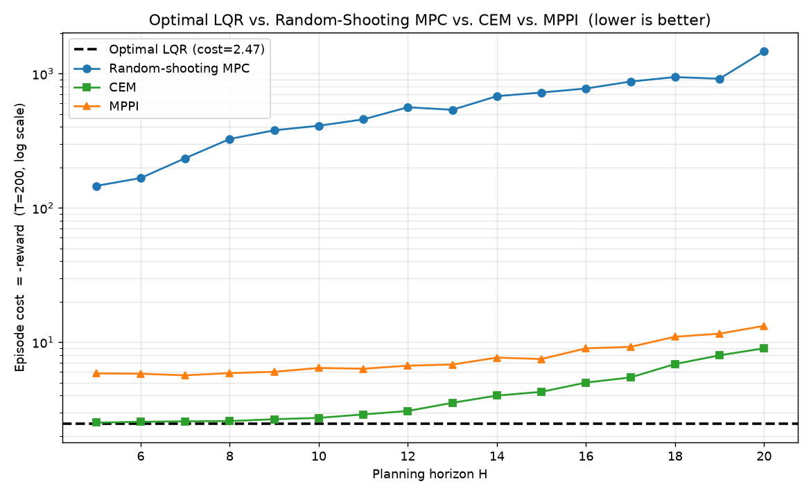

Github branch: https://github.com/248lee/MPC-Assignment/tree/PolicyPriorCEM

# 2026/07/03 實驗報告書

這次實作了將 SAC Policy 用於 CEM 的 Policy Prior 上，並使用一樣的 MPC 演算法 rollout 同樣的 LQR system。

## 1. 實驗動機
驗證 Policy Prior 的品質是不是 MPC-CEM 成功的重點

## 2. 結論簡答
不是，而且 CEM 搭配太長的 planning horizon (也就是 $H$ 太大) 還會破壞 Policy Prior 的品質。

## 3. 實驗方法

### 3.1 取得 SAC Policy Prior
Policy Prior 使用先前訓練好的 SAC 網路（`sac_lqr.pt`）。該 SAC 為 **off-policy** 訓練：replay buffer 由 **MPPI（planning horizon $H=5$）** 蒐集，SAC 再從中蒸餾出一個 reactive 的神經網路策略。其 actor 為 squashed-Gaussian，在 tanh 之前輸出 Gaussian 參數 $(\mu_u, \sigma_u)$，經過 tanh 與線性縮放後得到實際 action。

值得先注意的是：若**不做任何 planning、純粹用這個訓練好的 SAC policy 做 model-free rollout（非 MPC 意義下）**，在相同 episode（$s_0=[1,-1,0.5]$、$T=200$）下其 cost-to-go 為 **2.99**（即實驗結果圖中的紅色虛線）；作為對照，最優 LQR 的 cost-to-go 為 2.47。也就是說，SAC 本身已相當接近最優。

為了把 SAC 當成「取樣分布」的先驗，我們同時取出其在 **action 空間**的平均與標準差。設縮放係數為 `scale`、平移為 `bias`，以 delta method 對 tanh 做線性化：

$$\text{mean} = \tanh(\mu_u)\cdot \text{scale} + \text{bias}, \qquad \text{std} \approx \text{scale}\cdot\left(1 - \tanh^2(\mu_u)\right)\cdot \sigma_u$$

實測 SAC 的 action std 約為 $0.14$（各狀態相近），乘上放大係數後即作為 CEM 的初始探索寬度。

### 3.2 Policy-Prior CEM 演算法
本次的核心修改：把 Phase II 的 CEM（`phase2.py`）改成 `policy_prior.py`，**保留 CEM 的 refinement 迴圈，但移除 warm start（不再把上一時刻收斂的計畫往前平移），改由 SAC policy prior 來初始化每一個 timestep 的取樣分布**。

在每個 timestep、給定當前狀態 $s$：

1. **以 policy prior 初始化分布**：將 SAC 的平均 action 沿著（已知的）確定性模型往前 rollout $H$ 步，得到初始平均序列 $\mu \in \mathbb{R}^{H\times 3}$；初始標準差序列 $\sigma$ 則取自各步 SAC 的 action std，並**乘上 5.0**：

$$\mu[h] = \text{SAC mean action}, \quad \sigma[h] = 5.0 \times \text{SAC action std}, \quad h = 0,\dots,H-1$$

   乘上 5.0 是為了把先驗「放寬」，讓 CEM 仍保有足夠的探索空間。

2. **CEM refinement（與 `phase2.py` 相同）**：從 $\mathcal{N}(\mu, \sigma^2)$ 取樣 $N$ 條 action 序列並 clip 到 action 邊界；用模型估計每條序列的 $H$-step 折扣報酬；取報酬最高的前 $K$ 條 elites，重新擬合 $\mu$ 與 $\sigma$；重複直到收斂（$\|\mu-\mu_{\text{prev}}\|$ 或 $\max(\sigma)$ 低於門檻）。

3. **執行首個 action**：執行 $\mu[0]$，環境前進一步，**不做 warm start**，下一個 timestep 再重新以 SAC prior 初始化。

### 3.3 比較基準與掃描設定
在 `compare.py` 中，讓所有控制器在**完全相同**的 episode（相同 env、相同初始狀態 $s_0 = [1, -1, 0.5]$、相同 seed）下比較，並掃描 planning horizon $H = 1, \dots, 20$。共同超參數：每步取樣數 $N=1000$、elites $K=50$、episode 長度 $T=200$、`seed=0`。

比較對象：

- **Optimal LQR**：解 DARE 得到的最優線性回授 $a=-Ks$，作為理論上限（與 $H$ 無關，畫成水平虛線）。
- **Random-shooting MPC**（Phase I）：固定 proposal 的一次性取樣。
- **CEM**（Phase II）：有 warm start、$\sigma_{\text{init}}=0.2$ 的標準 CEM。
- **SAC**：直接執行 SAC reactive 策略（無 planning horizon，畫成水平虛線）。
- **Policy-Prior CEM**：本次方法（3.3 節）。

# 4. 實驗結果

可以看到擁有 Policy prior 的 CEM 表現比較差就算了，甚至到 $H = 9$ 以後還低於原本的 SAC performance (紅色虛線)。這證明至少以這裡來說 CEM 就是來搞人的。具體數據如下:

----------------------------------------------------------------------
  H |     MPC reward |     CEM reward |  PolPrior reward

  1 | -202005272151307848517681152.000 | -232804925955544543412617216.000 |        -2838.304
  2 |        -15.876 |         -2.497 |           -2.466
  3 |        -50.118 |         -2.487 |           -2.466
  4 |        -87.913 |         -2.491 |           -2.467
  5 |       -145.643 |         -2.511 |           -2.470
  6 |       -166.688 |         -2.547 |           -2.494
  7 |       -234.232 |         -2.565 |           -2.573
  8 |       -325.558 |         -2.566 |           -2.727
  9 |       -378.057 |         -2.637 |           -3.035
 10 |       -408.697 |         -2.661 |           -3.297
 11 |       -455.724 |         -2.747 |           -3.736
 12 |       -561.197 |         -2.871 |           -4.410
 13 |       -537.112 |         -3.121 |           -5.226
 14 |       -678.641 |         -3.417 |           -6.661
 15 |       -722.628 |         -3.455 |           -7.406
 16 |       -773.889 |         -3.629 |           -8.910
 17 |       -871.651 |         -4.199 |          -10.094
 18 |       -941.854 |         -4.635 |          -11.324
 19 |       -915.099 |         -5.265 |          -13.688
 20 |      -1464.449 |         -5.701 |          -15.061
Saved results to compare_results.npz

不過，在 $H$ 夠小的時候確實有 policy prior 會好一些。