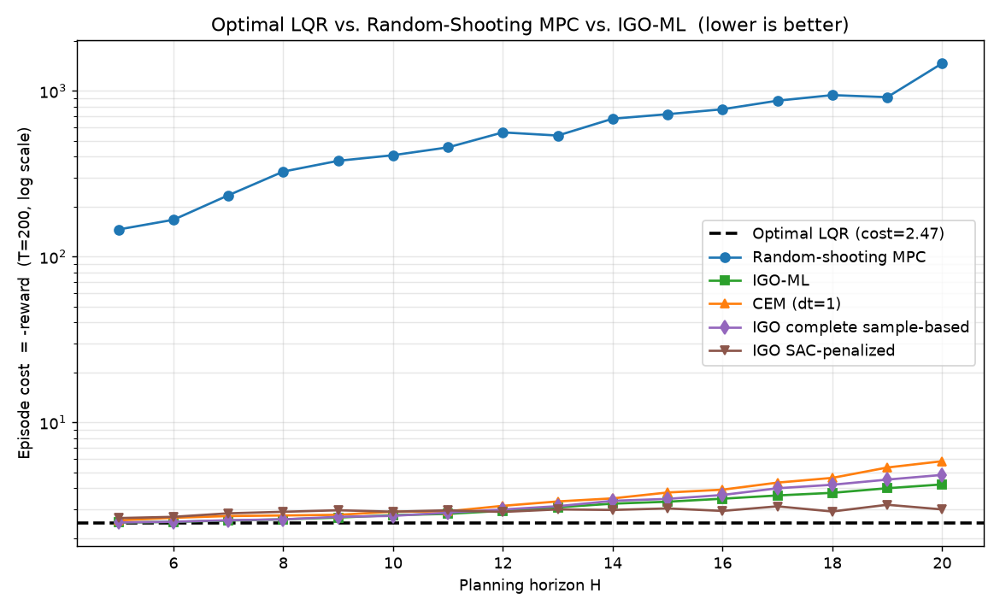

# IGO-ML：以「軟更新」抵抗過早收斂的 MPC 規劃器

本分支（`IGO`）在原本的 LQR / MPC 作業（CEM、MPPI、Random Shooting）之上，實作並比較了
**IGO-ML（Information-Geometric Optimization, Maximum-Likelihood）** 規劃器。IGO-ML 可以視為
**「軟版本的 CEM」**：它以步長 `dt` 對取樣分佈做漸進更新，並加入一項 **變異數注入
（variance injection）**，用來對抗 CEM 常見的**過早收斂（premature convergence）**問題。



各規劃視野 `H` 下的 episode reward（越接近 0 越好），以及每步過早收斂旗標統計（`premature`，格式為 `igo / cem`，分母 200 為總步數）：

| H | MPC reward | IGO reward | CEM reward | premature (igo / cem) |
|---:|---:|---:|---:|:---:|
| 1 | -2.020e26 | -2.336e26 | -2.347e26 | 0/200 , 0/200 |
| 2 | -15.876 | -2.471 | -2.580 | 0/200 , 1/200 |
| 3 | -50.118 | -2.469 | -2.563 | 0/200 , 1/200 |
| 4 | -87.913 | -2.473 | -2.582 | 0/200 , 1/200 |
| 5 | -145.643 | -2.483 | -2.559 | 0/200 , 1/200 |
| 6 | -166.688 | -2.507 | -2.653 | 0/200 , 1/200 |
| 7 | -234.232 | -2.553 | -2.718 | 0/200 , 4/200 |
| 8 | -325.558 | -2.596 | -2.740 | 0/200 , 2/200 |
| 9 | -378.057 | -2.661 | -2.765 | 0/200 , 5/200 |
| 10 | -408.697 | -2.751 | -2.885 | 0/200 , 8/200 |
| 11 | -455.724 | -2.801 | -2.902 | 0/200 , 15/200 |
| 12 | -561.197 | -2.923 | -3.132 | 0/200 , 32/200 |
| 13 | -537.112 | -3.068 | -3.329 | 0/200 , 47/200 |
| 14 | -678.641 | -3.228 | -3.473 | 0/200 , 46/200 |
| 15 | -722.628 | -3.316 | -3.769 | 0/200 , 65/200 |
| 16 | -773.889 | -3.457 | -3.919 | 0/200 , 80/200 |
| 17 | -871.651 | -3.617 | -4.323 | 0/200 , 100/200 |
| 18 | -941.854 | -3.752 | -4.618 | 0/200 , 113/200 |
| 19 | -915.099 | -3.999 | -5.332 | 0/200 , 135/200 |
| 20 | -1464.449 | -4.217 | -5.823 | 0/200 , 144/200 |

> `H=1` 三者皆發散（reward ≈ -2×10²⁶）。隨著 `H` 增大，Random-Shooting MPC 的 reward 大幅惡化，
> CEM 開始出現越來越多過早收斂（`H=20` 時 62/200），而 IGO-ML 全程 0/200、reward 也維持最接近最優。

---

## 執行方式

本專案使用 [uv](https://github.com/astral-sh/uv) 管理環境（見 `pyproject.toml` / `uv.lock`）。

```bash
# 同步依賴
uv sync

# 主要實驗: 比較純 CEM 與 IGO（產生 compare_*.png 與 premature CSV）
uv run python compare_CEM_and_IGO.py

# IGO實驗 (包含 TD-MPC styled Planning with IGO)（產生 compare_*.png 與 premature CSV）
uv run python compare.py
```

> 若不使用 uv，也可直接用虛擬環境的直譯器執行，例如
> `.venv/Scripts/python.exe compare_CEM_and_IGO.py`。

---

## 核心想法

CEM 每一輪都直接把高斯分佈**硬替換**成菁英（elite）樣本的平均與標準差：

```
mu, sigma <- 菁英平均 / 菁英標準差
```

這種硬替換會讓變異數快速塌縮，一旦樣本還沒探索到好的區域就先收斂，就會卡在次佳解。

IGO-ML 改為對自然參數做**軟更新**，並額外加入變異數注入項：

```
variance_injection = dt * (1 - dt) * (mu_star - mu)^2
sigma^2  <-  (1 - dt) * sigma^2  +  dt * sigma_star^2  +  variance_injection
mu       <-  (1 - dt) * mu       +  dt * mu_star
```

- `dt`（步長，介於 0 與 1 之間）控制更新速度。
- **當 `dt = 1` 時**，注入項消失，更新式退化為標準 CEM（`mu = mu_star`、`sigma^2 = sigma_star^2`）。
- **當 `dt < 1` 時**，變異數注入會依平均移動量補回探索用的變異數，使搜尋不會過早塌縮。

這正是本作業在 `premature.py` 中於一維線性目標上研究的更新式，在此被**從純量提升到
`(horizon × action_dim)` 的動作序列分佈**，並套進與 CEM / MPPI 相同的 MPC（receding-horizon +
warm-start）外框架。

---

## 環境設定：LQR

測試環境（[lqr_env.py](lqr_env.py)）是一個 3 維狀態、3 維動作的線性二次調節器：

- 動力學：`s_{t+1} = A s_t + B a_t (+ 噪聲)`
- 獎勵：`r(s, a) = -(sᵀ Q s + aᵀ R a)`
- `A` 被設計成**略為不穩定**，因此「不控制」的代價很高，規劃視野（horizon）的長短才會真正產生影響。

目前程式碼（[lqr_env.py](lqr_env.py)）採用的預設矩陣如下：

```
        [ 1.10  0.10  0.00 ]              [ 1  0  0 ]
    A = [ 0.00  1.05  0.10 ]          B = [ 0  1  0 ]
        [ 0.05  0.00  1.10 ]              [ 0  0  1 ]

        [ 1  0  0 ]                       [ 0.1  0    0   ]
    Q = [ 0  1  0 ]              R = 0.1·I = [ 0    0.1  0   ]
        [ 0  0  1 ]                       [ 0    0    0.1 ]
```

- `A` 的三個對角元皆 > 1（1.10、1.05、1.10），特徵值落在單位圓外，所以系統本身會發散——這正是「不控制就爆掉」的來源。
- `B = I`：三個動作各自直接推動一個狀態維度。
- `Q = I`：對三個狀態維度的偏差等權懲罰；`R = 0.1·I`：對控制力道施加較輕（0.1 倍）的懲罰，因此策略傾向積極控制。

其他預設參數：動作範圍 `[-10, 10]`、`noise_std=0`（比較實驗用確定性動力學）、`init_state_std=1.0`。

API 遵循 Gymnasium 慣例（`reset` / `step`），同一個物件既可當作代理人實際互動的**真實環境**，
也可當作規劃器內部展開（rollout）用的**模型**。

---

## 主要檔案

| 檔案 | 說明 |
|------|------|
| [IGO.py](IGO.py) | **純 IGO-ML 規劃器**。與 `phase2.py` 的 CEM 是同級手足，共用同一套 MPC 外框架（warm-start、shift 計畫）。`dt=1` 即退化為 CEM。 |
| [policy_prior_IGO.py](policy_prior_IGO.py) | **帶策略先驗（policy prior）的 IGO-ML**。以訓練好的 SAC 策略（`sac_lqr.pt`）滾動出的軌跡當作每步的初始取樣分佈，取代 warm-start；同時保留 IGO-ML 的軟更新。含閉式有限視野 LQR 上界作為收斂判準。 |
| [premature.py](premature.py) | 在一維線性目標上，展示不同 `dt` 下變異數軌跡的塌縮 / 維持行為，說明 IGO-ML 抵抗過早收斂的機制。 |
| [compare_CEM_and_IGO.py](compare_CEM_and_IGO.py) | **主比較實驗**。在完全相同的 episode 上比較 Optimal LQR、Random-Shooting MPC、IGO-ML、CEM（`dt=1`）在不同 horizon 下的表現，並記錄每步是否過早收斂。 |
| [lqr_env.py](lqr_env.py) | LQR 環境（含批次化的 reward / dynamics 輔助函式）。 |
| [phase1.py](phase1.py) / [phase2.py](phase2.py) | Phase I（Random Shooting）與 Phase II（CEM / MPPI）的原始規劃器。 |
| [optimal.py](optimal.py) | 解析解 LQR 回饋控制器（`a = -K s`），作為黃金標準基準。 |
| [sac_lqr.py](sac_lqr.py) | 訓練 SAC 策略，供 policy-prior 版本使用。 |

---

## 過早收斂偵測

`IGOPlanner` 提供 `detect_premature` 選項。開啟後，每步在計畫收斂時會做一個檢查：對 `mu`
的每一個維度施加 ±10σ 的擾動，若任何一個擾動後的計畫回報**優於**收斂計畫，就標記為
「過早收斂」（代表規劃器在到達局部最優前就停下了）。

`compare_CEM_and_IGO.py` 會把 IGO 與 CEM 每步的旗標寫到
[premature_check_CEM_and_IGO.csv](premature_check_CEM_and_IGO.csv)，用以量化比較兩者過早收斂的頻率。

---

## 實驗結論

比較圖（`compare_cem_mppi.png` 等）展示的重點：

1. **短視野會失敗**：`H=1` 的 Random Shooting 即使有精確動力學也會發散——單步回報看不到下一個
   狀態，於是選出 `a≈0`，不穩定系統隨即爆掉。
2. **幾步的前瞻就接近最優**：`H≈2` 時 Random Shooting 已接近最優。
3. **固定取樣預算下，長視野對 Random Shooting 反而變差**：搜尋空間是 `3×H` 維，best-of-N 覆蓋不了。
4. **IGO-ML 在各視野都貼近最優**：透過精煉取樣分佈，加上變異數注入的軟更新抵抗 CEM 的過早收斂，
   IGO-ML 不會像 Random Shooting 那樣在大 `H` 時退化。

