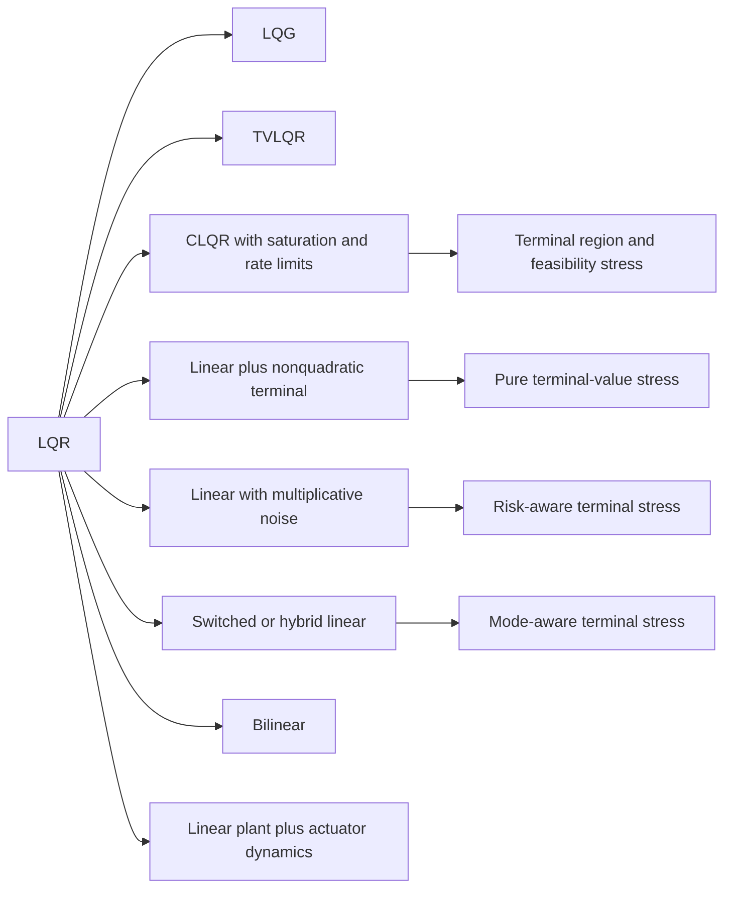
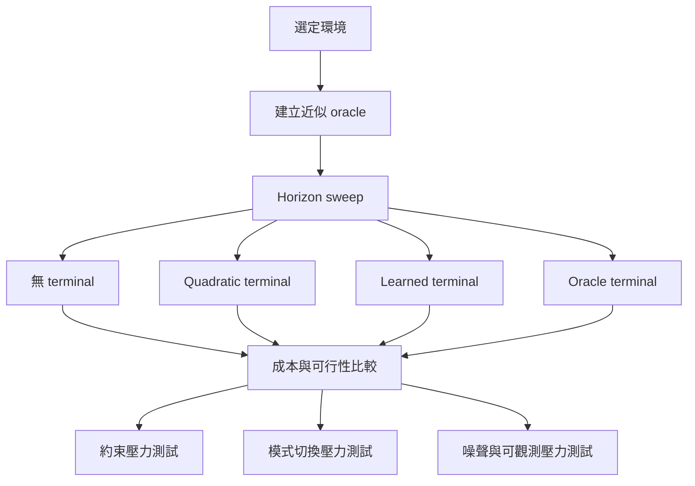

# 比 LQR 更嚴格的矩陣化控制環境

## 執行摘要

若你的研究目標是測試**必須顯式處理 terminal value** 的 RL 或 planning 方法，單純的 LQR 通常太容易：在標準線性、二次、無約束、可完全觀測的設定下，有限時域最佳值函數可由 Riccati 遞迴完全描述，其終端條件只是 $S_N$，因此 terminal value 的結構幾乎被單一 quadratic ansatz 吸收，不容易分辨新方法到底有沒有真正學到「尾端代價」。相較之下，只要加入 input/state constraints、mode switching、部分可觀測、乘法噪聲、非二次 terminal cost 或雙線性耦合，值函數便不再是單一全域二次型，terminal value 的表達能力就會直接影響短時域規劃品質、可行域、風險暴露與 mode 選擇。這些特性正是你要測的東西。citeturn18view1turn7view1turn7view3turn16view0

在所有仍然能以矩陣形式乾淨表示的候選中，本報告最推薦的前三名是：**受限 LQR 含 input saturation 與 rate limits**、**switched 或 hybrid linear systems**、以及**線性動態配非二次 terminal cost**。第一類最接近 LQR、最容易實作，但其值函數已變成 piecewise quadratic，且 terminal cost/terminal set 對可行性與短 horizon 性能非常敏感；第二類讓值函數變成 mode-dependent，甚至是有限個 quadratic 的 pointwise minimum；第三類則把困難集中在 terminal value 本身，而不是把所有難度都混進 dynamics，非常適合做 terminal-value 方法的乾淨壓力測試。citeturn7view1turn0search12turn11view0turn11view4turn16view0turn7view5

相對地，**LQG** 與 **time-varying LQR** 很適合做第一層 sanity check：LQG 提供 stochasticity 與 partial observability，TVLQR 讓 finite-horizon terminal condition 進入時間相依的 Riccati recursion；但在理想假設下，兩者仍有相當完整的解析結構，因此更適合作為「先驗證方法沒有犯原理性錯誤」的基準，而不是最終 benchmark。**乘法噪聲線性系統**、**bilinear systems**、以及**含 actuator dynamics 的增廣線性系統**則更適合作為第二層或第三層壓力測試。citeturn7view6turn18view1turn10view1turn10view0turn13view0turn13view3turn21view0

## 評估框架與比較總覽

本報告把「比 LQR 更適合測 terminal value」的環境，統一用以下維度評估：狀態與動作維度、線性或非線性動態、過程與量測隨機性、輸入/狀態/速率限制、stage cost 與 terminal cost 結構、是否部分可觀測、是否時變、非線性程度，以及**closed-form value 是否存在**。其中最關鍵的準則不是「問題有多難」，而是「難度來源能否被隔離」。例如，若你想專測 terminal value，本報告會優先推薦「線性 dynamics + 非二次 terminal」而非一開始就上 bilinear；若你想測短 horizon 規劃時 tail cost 對可行性與穩定性的作用，則應優先選 constrained LQR。這種分層方式和 MPC/finite-horizon optimal control 教科書中的 $V_f(x_N)$、$X_f$、以及短 horizon 需要 terminal ingredients 才能維持性能與穩定性的論述是一致的。citeturn8view6turn9view4turn18view1turn7view5



下表的維度若文獻未提供固定 benchmark，本報告都明確標成**建議預設**，不宣稱是文獻唯一標準設定。

| 候選環境 | 建議預設維度 | 動態類型 | 隨機性 | 約束 | 部分可觀測 | 成本與 terminal | closed-form value | 為何比 LQR 更適合測 terminal value | 主要依據 |
|---|---|---|---|---|---|---|---|---|---|
| LQG | $n=6,m=2,p=3$ | 線性 | process + observation Gaussian noise | 標準版無，可外加 | 是 | quadratic stage + quadratic terminal $S$ | 有；分離原理 + Riccati/Kalman recursion | terminal value 需作用在 belief / estimate，而非真實全狀態 | citeturn7view6turn8view5 |
| TVLQR | $n=6,m=2$ | 線性時變 | 可無或小 process noise | 可選 | 否 | $Q_k,R_k,S_N$；沿軌跡 tracking cost | 有；時變 Riccati family | terminal condition $S(t_f)$ 往回傳播，短 horizon 特別敏感 | citeturn18view1turn18view2turn10view3 |
| 受限 LQR | $n=6,m=2$，rate-limit 時增廣至 $n+m$ | 線性 | 可無或小噪聲 | state/input/rate constraints | 否 | quadratic stage + quadratic 或 learned terminal | 一般無單一 closed form；小規模可做 explicit MPC | 值函數轉為 PWQ，policy 轉為 PWA，terminal cost/terminal set 直接影響可行域與穩定性 | citeturn7view1turn9view4turn0search12turn21view0 |
| 乘法噪聲線性系統 | $n=4\!-\!8,m=1\!-\!3$ | 線性隨機係數 | multiplicative noise，可再加 additive noise | 可選 | 否 | expected quadratic stage + terminal $S$ | 僅在特定假設下有 generalized Riccati characterization | terminal value 需同時吸收尾端狀態與噪聲放大量 | citeturn10view1turn10view0turn19search11 |
| 線性 + 非二次 terminal | $n=6,m=2$ | 線性 | 可無 | 可選 | 否 | quadratic stage + $\phi(x_N)$，如 $\ell_1$/Huber/max-affine | 一般無單一 quadratic closed form | 只在 terminal 打破 Riccati closure，最乾淨地隔離 terminal-value 問題 | citeturn16view0turn7view5 |
| Switched linear / hybrid MLD | $n=4\!-\!8,m=1\!-\!2,M=2\!-\!4$ | switched / hybrid | mode 可控或外生；可加噪聲 | 常見 mixed logical、state/input constraints | 可做輸出版 | mode-dependent quadratic + terminal $S_{\sigma}$ 或 $\phi_{\sigma}$ | switched LQ 有有限個 quadratic 的最小值結構；一般 MLD 無單一 closed form | terminal value 會影響 mode 選擇與 terminal region 佈局 | citeturn11view0turn11view4turn12view2 |
| Bilinear | $n=4\!-\!6,m=1\!-\!2$ | 雙線性 | 可無或小噪聲 | 可加輸入限制 | 否 | quadratic stage + terminal $S$；或 BBR biquadratic cost | 一般無 | 非線性來自 $x$ 與 $u$ 的二次耦合，tail cost 不再適合單一 quadratic critic | citeturn13view0turn13view3turn14view0 |
| 線性 plant + actuator dynamics | plant $n_p=4\!-\!6$，actuator $n_a=1\!-\!2$ | 增廣後仍線性 | 可加 process/measurement noise | 建議一定加 saturation/rate limit | 可做輸出版 | augmented quadratic stage + terminal；可懲罰 $\Delta u$ | 無 constraints 時有；有 rate/sat 時一般無簡單 closed form | terminal cost 必須評估 plant 與 actuator 內部狀態的尾端殘留 | citeturn21view0turn10view2 |

## 候選環境分析

**LQG。** 標準離散型可寫成
$$
x_{k+1}=Ax_k+Bu_k+w_k,\qquad
y_k=Cx_k+Du_k+v_k,
$$
其中 $w_k\sim \mathcal N(0,M)$、$v_k\sim \mathcal N(0,N)$，成本為
$$
J=\mathbb E\!\left[\sum_{k=0}^{N-1}(x_k^\top Qx_k+u_k^\top Ru_k)+x_N^\top Sx_N\right].
$$
這個環境比 LQR 難，不是因為 dynamics 複雜，而是因為 terminal value 不再作用在真實全狀態，而要作用在 state estimate 或 belief 上；若你的方法是 planning-based，必須決定 tail cost 是定義在 $\hat x_k$ 還是 $(\hat x_k,\Sigma_k)$；若你的方法是 model-free，則需要 history-dependent policy 或 latent-state memory。標準 LQG 在高斯線性條件下仍滿足 separation principle，因此**closed-form value 可視為存在**，但它對 terminal-aware 方法仍然是很好的 sanity check。若文獻未指定維度，本報告建議從 $n=6,m=2,p=3$ 開始，令 $C$ 只量到部分位置、不量速度，並把 horizon 設在 $H=5\!-\!15$ 之間來放大 terminal influence。主要實作陷阱是：若你同時學 estimator 與 controller，請另外記錄 estimation RMSE，否則很難分辨失敗是 terminal critic 壞，還是 state estimation 壞。Model-based 方法非常適合；model-free 則以 recurrent actor-critic 或 latent world model 較合理。主要來源是 LQG 講義與 separation theorem。citeturn7view6turn8view5

**Time-varying LQR。** 可寫成
$$
x_{k+1}=A_kx_k+B_ku_k+d_k,
$$
$$
J=\sum_{k=0}^{N-1}(x_k^\top Q_kx_k+u_k^\top R_ku_k)+x_N^\top S_Nx_N.
$$
若以 tracking 形式實作，常用誤差座標 $\bar x_k=x_k-x_k^{\mathrm{nom}}$、$\bar u_k=u_k-u_k^{\mathrm{nom}}$，然後沿 nominal trajectory 線性化得到 time-varying model。它比 LQR 難，因為 cost-to-go $V_k(x)$ 與 feedback gain $K_k$ 都顯式依賴時間，terminal condition $S_N$ 會沿時間反向傳播，並直接決定短 horizon 的行為。就值函數而言，它仍有**time-varying Riccati recursion** 的解析結構，因此最適合拿來驗證 finite-horizon terminal handling 是否正確，而不是最終 benchmark。若文獻未指定維度，本報告建議 $n=6,m=2$，並讓 $A_k,B_k,Q_k$ 在一個週期內於兩種動態 regime 間切換，或令 nominal 軌跡穿過近不穩定區域，以放大 $S_N$ 的影響。實作上可直接使用 finite-horizon LQR / TVLQR；Drake 已提供 finite-horizon LQR 介面。citeturn18view1turn18view2turn10view3turn5search10

**受限 LQR with input saturation 與 rate limits。** 基本模型為
$$
x_{k+1}=Ax_k+Bu_k,\qquad x_k\in X,\quad u_k\in U.
$$
若要加入速率限制，最穩妥的矩陣做法是用增廣狀態
$$
\tilde x_k=\begin{bmatrix}x_k\\u_{k-1}\end{bmatrix},\qquad
\tilde x_{k+1}=
\begin{bmatrix}A&B\\0&I\end{bmatrix}\tilde x_k+
\begin{bmatrix}B\\I\end{bmatrix}\Delta u_k,
$$
再令
$$
u_k=u_{k-1}+\Delta u_k,\qquad
u_k\in U,\quad \Delta u_k\in \Delta U.
$$
成本可設為
$$
J=\sum_{k=0}^{N-1}\left(x_k^\top Qx_k+u_k^\top Ru_k+\Delta u_k^\top R_\Delta \Delta u_k\right)+x_N^\top Sx_N,
$$
或直接在增廣狀態上寫成 $\tilde x_k^\top \tilde Q\tilde x_k$。這類問題比 LQR 難的根本原因，是最優 policy 會變成 piecewise affine，而值函數會變成 piecewise quadratic；MPC 文獻中，terminal cost 與 terminal set 還會直接影響穩定性與 region of attraction。這讓它成為最適合測 terminal value 的「第一主 benchmark」。若文獻未指定維度，本報告建議從 $n=6,m=2,H\in\{4,8,12\}$ 開始，同時加 amplitude limit 和 rate limit，並讓 unconstrained LQR 需要超過當前 horizon 才能把系統帶進終端安全區。主要陷阱是：若你把 horizon 設太長，terminal cost 的重要性會被沖淡；若你不加 rate limit，問題會退化得離單純 CLQR 太近。Model-based 方法最合適；model-free 可作對照，但必須非常小心 constraint handling。主要來源包括 explicit constrained LQR 原始論文、MPC 教科書，以及利用 PWQ 結構近似 CLQR value function 的近期文獻。citeturn7view1turn9view4turn21view0turn0search12

**線性系統加乘法噪聲。** 一個常用的離散矩陣形式是
$$
x_{k+1}=
\left(A+\sum_{i=1}^r \xi_{i,k}\bar A_i\right)x_k+
\left(B+\sum_{j=1}^s \eta_{j,k}\bar B_j\right)u_k+w_k,
$$
其中 $\xi_{i,k},\eta_{j,k}$ 是零均值隨機變數。成本保持
$$
J=\mathbb E\!\left[\sum_{k=0}^{N-1}(x_k^\top Qx_k+u_k^\top Ru_k)+x_N^\top Sx_N\right].
$$
這比加性噪聲版 LQG 更難，因為過程的不確定性不只是加在右端，而會直接改變系統增益；前面幾步的控制不只決定狀態，也決定後續噪聲放大的方向與強度。相關文獻表明，有限時域下這類問題可用 generalized Riccati equation 描述；在更一般的 state/control-dependent noise 設定下，則會出現 generalized Riccati 或 Riccati-ZXL 類方程，而不是標準 LQR Riccati。若文獻未指定維度，本報告建議從 $n=4,m=2,r=s=1$ 起步，讓 $\bar A_1$ 只作用在某個弱不穩定模態上，並提高對該模態的 terminal 權重。closed-form value 的精確說法是：**一般沒有標準 LQR 式單一 closed form，但在特定可解假設下有 generalized Riccati characterization**。這一類特別適合 model-based stochastic MPC、risk-sensitive planning，或拿來測終端 critic 是否能學到風險敏感 tail cost。citeturn10view1turn10view0turn19search11turn19search4

**線性動態配非二次 terminal cost。** 這是最乾淨的 terminal-value benchmark。動態維持
$$
x_{k+1}=Ax_k+Bu_k,
$$
stage cost 維持 quadratic，
$$
\ell(x_k,u_k)=x_k^\top Qx_k+u_k^\top Ru_k,
$$
但 terminal 改成
$$
\phi(x_N)=\|W_Tx_N\|_1,\qquad
\phi(x_N)=\sum_i \mathrm{Huber}((W_Tx_N)_i),\qquad
\text{或}\quad
\phi(x_N)=\max_j a_j^\top x_N.
$$
Harvard 的 online optimal control 論文直接採用
$$
\min_{x,u}\ \sum_{t=0}^{N-1}\bigl(f_t(x_t)+g_t(u_t)\bigr)+f_N(x_N)
\quad\text{s.t.}\quad x_{t+1}=Ax_t+Bu_t,
$$
其中 terminal $f_N$ 可以是一般 convex function；而學習 convex terminal cost 來補償短 horizon optimality loss 的做法，也已有明確文獻。它比 LQR 更適合測 terminal value，因為**只有 terminal 打破 Riccati closure**，因此 performance gap 幾乎可以直接歸因到 terminal approximation，而不是 dynamics approximation。若文獻未指定維度，本報告建議 $n=6,m=2,H=5\!-\!10$，先做 $\ell_1$ terminal 與 Huber terminal 兩版。$\ell_1$ 會產生方向性明顯但非平滑的合適壓力；Huber 則能測方法對近端 quadratic / 遠端 linear 兩種 tail geometry 的適應能力。這一類非常適合 short-horizon planner + learned terminal critic，也適合比較 quadratic terminal、convex PWL terminal、ICNN terminal 等 parameterization。citeturn16view0turn7view5

**Switched linear systems 與 hybrid MLD systems。** Switched 線性系統可寫成
$$
x_{k+1}=A_{\sigma_k}x_k+B_{\sigma_k}u_k,\qquad \sigma_k\in\{1,\dots,M\},
$$
成本可寫成
$$
J=\sum_{k=0}^{N-1}\left(x_k^\top Q_{\sigma_k}x_k+u_k^\top R_{\sigma_k}u_k+\lambda_{\mathrm{sw}}\mathbf{1}[\sigma_{k+1}\neq \sigma_k]\right)+x_N^\top S_{\sigma_N}x_N.
$$
MLD/hybrid 版本則可統一為
$$
x_{k+1}=Ax_k+B_1u_k+B_2\delta_k+B_3z_k,
$$
$$
y_k=Cx_k+D_1u_k+D_2\delta_k+D_3z_k,
$$
$$
E_2\delta_k+E_3z_k\le E_1u_k+E_4x_k+E_5,
$$
其中 $\delta_k$ 為 binary logic variables。Bemporad–Morari 的 MLD 論文證明，mixed logical dynamical systems 可以以「線性動態方程 + 混合整數不等式」統一描述；而 Zhang–Hu 對 switched LQ 的動態規劃分析則指出，其 finite-horizon 值函數不再是單一 quadratic，而是**有限個 quadratic 函數的 pointwise minimum**，且最優增益會變成 state-dependent。這使它對 terminal-aware planning 特別有辨識力：錯誤的 terminal value 不只會讓你尾端代價估錯，還會讓你在前面就選錯 mode。若文獻未指定維度，本報告建議從 $M=2$ 開始，一個 mode 快但耗能高，另一個慢但省控制，並讓兩個 mode 的 terminal weight 不同；$n=4\!-\!6,m=1\!-\!2,H=6\!-\!12$ 已足夠。一般 switched LQ 可用 mode-conditioned DP 或 MIQP 求近似 oracle；一般 MLD 沒有單一閉式值函數，較適合 model-based benchmark。citeturn11view0turn11view4turn12view1turn12view2

**Bilinear systems。** 一個標準離散矩陣形式是
$$
x_{k+1}=Ax_k+\sum_{j=1}^{m}u_{k,j}N_jx_k+Bu_k,
$$
輸出若需要則寫成 $y_k=Cx_k$。在 bilinear 文獻中，這類系統常被描述為「對 state 線性、對 input 也線性，但對 state 與 input 並非 jointly linear」，本質是在線性模型上加上一個 state-control product term。若只保持 quadratic stage cost，
$$
J=\sum_{k=0}^{N-1}(x_k^\top Qx_k+u_k^\top Ru_k)+x_N^\top Sx_N,
$$
已足以形成比 LQR 更難的 matrix-representable benchmark；若再進一步採用 Bilinear Biquadratic Regulator，
$$
J=\sum_{k=0}^{N-1}\left(x_k^\top Qx_k+u_k^\top Ru_k+(x_k\otimes u_k)^\top F(x_k\otimes u_k)\right)+x_N^\top Sx_N,
$$
則值函數更不可能由單一 quadratic critic 充分描述。Clarke 等人的 BBR 工作明確指出，其困難來自 bilinear cross-term in dynamics 與 biquadratic performance index。若文獻未指定維度，本報告建議先從 $n=4,m=1$ 的 bilinear dynamics + quadratic cost 開始，再升級到 BBR。這個環境適合測「critic 是否能吸收 state-input coupling 的長期效應」，但一開始不建議拿來做第一主 benchmark，因為 dynamics 難度與 terminal 難度很容易糾纏在一起。citeturn13view0turn13view1turn13view3turn14view0

**線性 plant 加 actuator dynamics。** 一個簡潔寫法是
$$
x_{k+1}^p=A_px_k^p+B_pa_k,
$$
$$
x_{k+1}^a=A_ax_k^a+B_av_k,\qquad a_k=C_ax_k^a+D_av_k.
$$
令增廣狀態 $\bar x_k=[(x_k^p)^\top,(x_k^a)^\top]^\top$，即可寫成單一線性系統
$$
\bar x_{k+1}=
\begin{bmatrix}
A_p & B_pC_a\\
0 & A_a
\end{bmatrix}\bar x_k+
\begin{bmatrix}
B_pD_a\\
B_a
\end{bmatrix}v_k.
$$
若再加入 rate penalty 或 rate limit，則可改用前述 $\Delta u_k=u_k-u_{k-1}$ 的增廣寫法。它比 LQR 難的真正原因不在於「多了幾個狀態」，而在於**actuator memory 使當前 action 的後果會延伸到 horizon 之外**；若再加 saturation 與 rate limits，terminal value 就必須同時評估 plant tail state 與 actuator tail state。若文獻未指定維度，本報告建議 $n_p=4\!-\!6,n_a=1\!-\!2,m=2$，讓 actuator time constant 明顯慢於 plant，並加上 $\Delta u$ 限制。需要特別強調的是：**若沒有飽和或速率限制，這類問題在數學上只是增廣後的 LQR，通常不值得當主 benchmark**；加上 constraints 後才真正有辨識力。Model-based MPC 特別合適；do-mpc 的 `LinearModel` 也很方便做快速原型。citeturn21view0turn10view2turn5search6

## 推薦前三名與理由

我建議的前三名排序是：**受限 LQR with input/rate constraints**、**switched/hybrid linear systems**、**線性 dynamics + 非二次 terminal cost**。第一名之所以是受限 LQR，不是因為它最複雜，而是因為它在**保持 LQR 可比性**與**真正破壞單一 quadratic value**之間達到最好平衡。它仍然是標準矩陣模型，卻能把值函數推向 PWQ、把 policy 推向 PWA，且 terminal cost/terminal set 對短 horizon 性能與可行域有直接影響。若你的方法主打 terminal critic、learned tail cost、或 finite-horizon planning enhancement，這一類最能乾淨地看出差異。citeturn7view1turn9view4turn0search12

第二名是 switched/hybrid 線性系統。它的優勢是 terminal value 不再只是狀態的尾端距離，而是**尾端 mode 與尾端 region 的價值**。這會迫使你的 terminal-value 近似器學到 piecewise 結構，而不是只學一個平滑 bowl-shaped critic。從理論上看，switched LQ 的值函數是有限個 quadratic 的 pointwise minimum；從計算上看，mode sequence 的組合複雜度又會讓短 horizon planner 特別仰賴好的 terminal value。若你的方法能在這裡穩定比過「無 terminal」與「單一 quadratic terminal」，它通常就有相當說服力。citeturn11view0turn11view3turn11view4

第三名是線性 dynamics + 非二次 terminal cost。它不是最難，但卻是**最乾淨的 ablation 環境**。若你的研究問題真的聚焦在「怎麼把 terminal value 學好」，那麼這一類應該幾乎是必做：因為此時 dynamics 沒有成為混雜因素，所有提升幾乎都能直接歸因到 terminal value representation。本報告特別推薦用 $\ell_1$、Huber、或 max-affine terminal 先做凸版本，再視需要升級到 piecewise nonconvex terminal。citeturn16view0turn7view5

LQG 與 TVLQR 我會保留為**第一層 sanity-check**；乘法噪聲與 bilinear 則作為**更高階壓力測試**。這樣的研究順序通常最有效率：先確認你的方法在解析結構仍大致存在的世界裡是對的，再逐步把值函數結構打碎。citeturn7view6turn18view1turn10view1turn14view0

## 壓力測試實驗設計

若你的研究重點是 terminal-value-aware planning，我建議把實驗設計成四個交叉軸。第一個軸是 **horizon sweep**，例如 $H\in\{2,4,8,16,32\}$；第二個軸是 **terminal source**，分成無 terminal、Riccati/hand-crafted quadratic terminal、oracle tail cost、learned terminal；第三個軸是 **difficulty sweep**，例如 constraints tightening、mode 數、噪聲強度、terminal 非平滑度或切換懲罰；第四個軸是 **observability/noise**，特別用在 LQG 與乘法噪聲版本。這樣才能回答：你的方法到底是在短 horizon 有效，還是在某一個特定難度設定才有效。有限時域 optimal control 與 online control 文獻都強調 terminal cost 與 lookahead window 會直接決定 performance gap，因此這種設計是有理論支撐的。citeturn18view1turn16view0turn7view5

建議的指標可分成四類。**性能類**應包含總 cost、與 oracle 的 suboptimality gap、平均與尾端 terminal cost、terminal state error。**約束類**應包含 state violation、input saturation 次數、rate-limit violation 與 infeasibility frequency。**資訊類**則依環境選擇 belief RMSE、estimation RMSE、mode-selection accuracy、risk-sensitive tail metrics。**計算類**應至少包含每步規劃時間、迭代次數、以及若為學習式 terminal critic，則再報告 tail-value approximation error。若你採 online-control 觀點，還可以把 dynamic regret 納入。這裡的具體指標組合是本報告對實驗設計的建議；其中 dynamic regret 的使用方式可參考 online optimal control 文獻。citeturn16view0

基準方法我建議固定放五組。第一組是 **短 horizon、無 terminal cost**；第二組是 **短 horizon + 經典 quadratic terminal**；第三組是 **長 horizon 或 explicit/MIQP MPC oracle**；第四組是 **你要測的新 terminal 方法**；第五組才是 **model-free 對照**，例如 SAC、TD3、PPO、recurrent PPO 等。對 switched/hybrid 問題，最好再加一個 mode-aware 或 MIQP-based baseline；對 bilinear 問題，可再加 iLQR/DDP 類局部規劃器。這樣你的比較才不會落入「只和很弱 baseline 比」的陷阱。MPC 與 explicit MPC 文獻已經給出強力理由：若一個方法宣稱 terminal handling 更好，就應該至少打贏無 terminal 與簡單 quadratic terminal。citeturn7view1turn9view4turn7view5



## 實作骨架與可複製程式片段

就工具鏈而言，**python-control** 適合做 LQR 基準，**Drake** 內建 finite-horizon LQR / TVLQR 相關介面，**do-mpc** 的 `LinearModel` 則直接是 simulator、MPC、LQR 與 estimator 的共用核心，對需要在同一框架下快速切換 LQG、TVLQR、CLQR 與增廣 actuator 模型的研究很方便。這幾個工具都屬於官方或主流文件來源，適合作為實作底座。citeturn10view4turn5search17turn10view2turn5search10

下面第一段程式建議你直接拿來做**受限 LQR + rate limit** 的研究骨架。它保留矩陣化動態，卻已經足夠讓 terminal value 成為主角。

```python
import numpy as np

def build_rate_limited_augmented_system(A, B):
    """
    z_k = [x_k; u_{k-1}]
    z_{k+1} = A_aug z_k + B_aug du_k
    u_k = u_{k-1} + du_k
    """
    n, m = B.shape
    A_aug = np.block([
        [A, B],
        [np.zeros((m, n)), np.eye(m)]
    ])
    B_aug = np.block([
        [B],
        [np.eye(m)]
    ])
    return A_aug, B_aug

def quadratic_cost(z, du, Qz, Rdu):
    return z @ Qz @ z + du @ Rdu @ du

def terminal_cost(z, S):
    return z @ S @ z

# example defaults proposed by this report
n, m = 6, 2
A = np.eye(n) + 0.1*np.random.randn(n, n)
B = 0.2*np.random.randn(n, m)

A_aug, B_aug = build_rate_limited_augmented_system(A, B)

Qx = np.diag([5, 5, 1, 1, 0.5, 0.5])
Qu_prev = 0.1*np.eye(m)
Qz = np.block([
    [Qx, np.zeros((n, m))],
    [np.zeros((m, n)), Qu_prev]
])
Rdu = 0.5*np.eye(m)
S = 10.0 * Qz

u_min = -0.8*np.ones(m)
u_max =  0.8*np.ones(m)
du_min = -0.15*np.ones(m)
du_max =  0.15*np.ones(m)
```

這個增廣寫法對應的理論背景，是把 $\Delta u_k=u_k-u_{k-1}$ 納入 stage cost，並將 $u_{k-1}$ 併入狀態；Rawlings–Mayne–Diehl 的教材明確指出這種增廣方式可把 rate-of-change penalty 轉回標準 LQR/MPC 形式。若你接著再加 input/state polytope constraints，就能直接得到非常適合測 terminal value 的 CLQR benchmark。citeturn21view0

下面第二段程式是**線性 dynamics + 非二次 terminal cost** 的最小可用骨架。它特別適合比較 quadratic terminal、$\ell_1$ terminal 與 Huber terminal。

```python
import numpy as np

def huber(x, delta=1.0):
    ax = np.abs(x)
    return np.where(ax <= delta, 0.5 * ax**2, delta * (ax - 0.5 * delta))

class LinearTerminalBenchmark:
    def __init__(self, A, B, Q, R, WT, horizon, terminal_type="l1"):
        self.A = A
        self.B = B
        self.Q = Q
        self.R = R
        self.WT = WT
        self.H = horizon
        self.terminal_type = terminal_type
        self.n, self.m = B.shape
        self.reset()

    def reset(self, x0=None):
        self.t = 0
        self.x = np.zeros(self.n) if x0 is None else x0.copy()
        return self.x.copy()

    def stage_cost(self, x, u):
        return x @ self.Q @ x + u @ self.R @ u

    def final_cost(self, x):
        z = self.WT @ x
        if self.terminal_type == "l1":
            return np.sum(np.abs(z))
        elif self.terminal_type == "huber":
            return np.sum(huber(z, delta=0.5))
        elif self.terminal_type == "max_affine":
            # Example: max over a bank of affine terms a_j^T x
            # WT is interpreted as a stack of row vectors
            return np.max(self.WT @ x)
        else:
            raise ValueError("Unknown terminal_type")

    def step(self, u):
        cost = self.stage_cost(self.x, u)
        self.x = self.A @ self.x + self.B @ u
        self.t += 1
        done = (self.t == self.H)
        if done:
            cost += self.final_cost(self.x)
        return self.x.copy(), -float(cost), done, {}
```

這類 benchmark 的理論好處是：它讓 finite-horizon 線性控制保留矩陣結構，但把終端 tail cost 從 Riccati 閉包中抽離；Harvard 的 online optimal control 論文直接以一般 convex terminal $f_N(x_N)$ 表述 finite-horizon 線性控制，而學習 convex terminal cost 來縮短 horizon 的做法已被明確用於 MPC。若你的方法真的善於處理 terminal value，這一類環境通常應該最先看得出來。citeturn16view0turn7view5

最後，若你只想選一條**最務實、最容易產出實驗結論**的路線，我建議依序做：**TVLQR 與 LQG 作 sanity checks，受限 LQR with saturation/rate limits 作主 benchmark，switched/hybrid linear 作第二主 benchmark，線性 + 非二次 terminal 作 terminal-ablation benchmark**。這條路徑既能保留 LQR 家族的矩陣可解釋性，又能逐步打破單一 quadratic value 的舒服結構，最適合拿來驗證你新的 terminal-value-aware RL/planning 方法是否真的有效。citeturn18view1turn7view6turn7view1turn11view0turn16view0